# revpdf

A minimalist, **fully local** document reader for **PDF, EPUB, DOC and DOCX** — built with
Expo + React Native and Google's Material Design 3. Modeled on ReadEra's calm reading
experience, with two signature additions: **hold-to-highlight** and a **Chrome-style selection
search** sheet.

Everything stays on the device. No accounts, no servers, no cloud.

- Website: [revpdf.in](https://revpdf.in) · [Terms](https://revpdf.in/terms) · [Privacy](https://revpdf.in/privacy)

## Screenshots

<p align="center">
  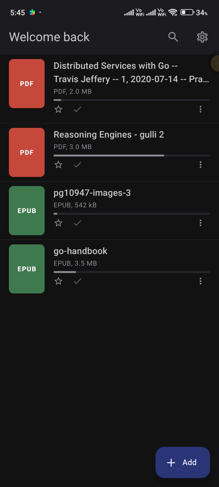
  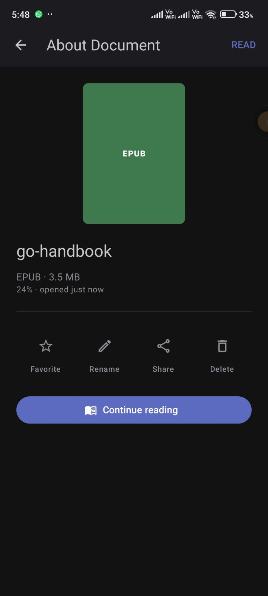
  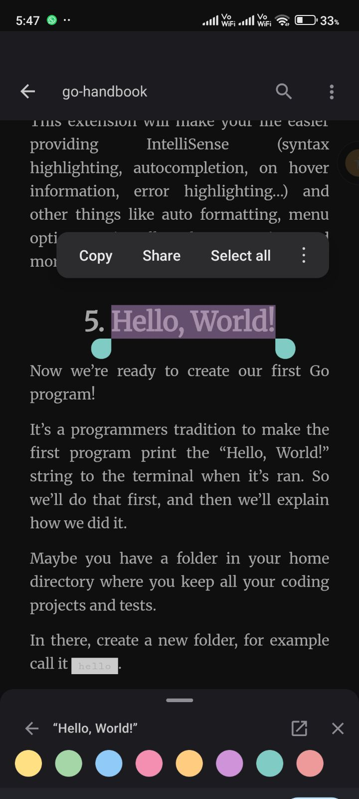
  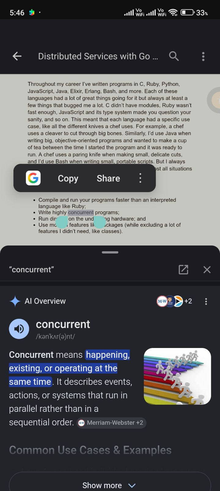
</p>
<p align="center">
  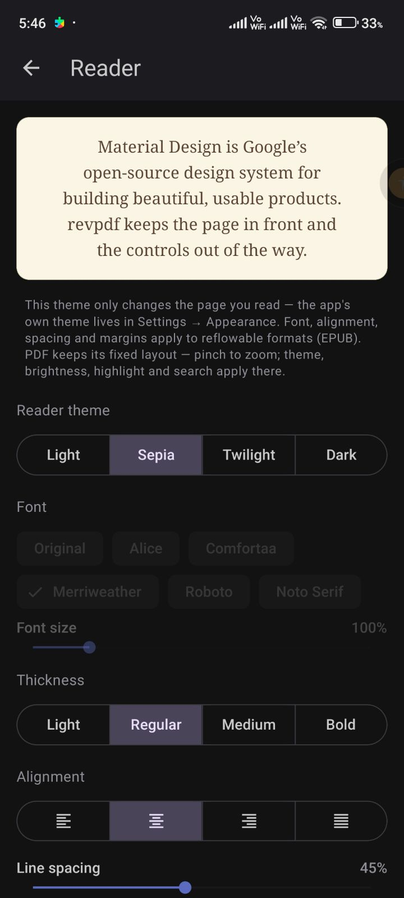
  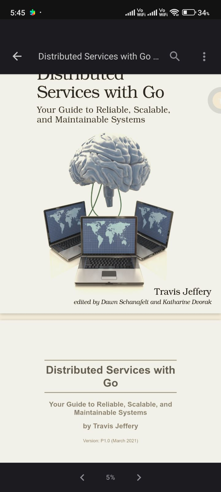
  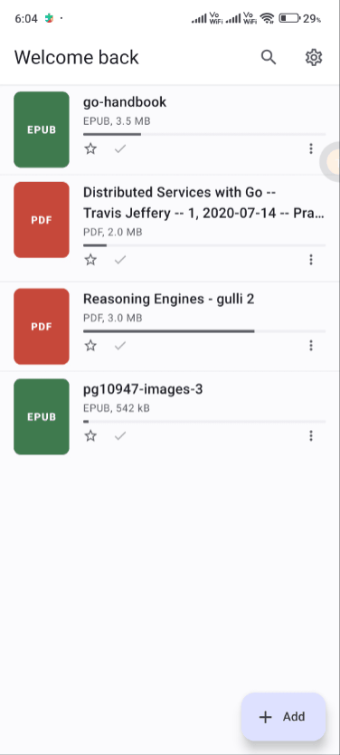
</p>

**Reading themes**

<p align="center">
  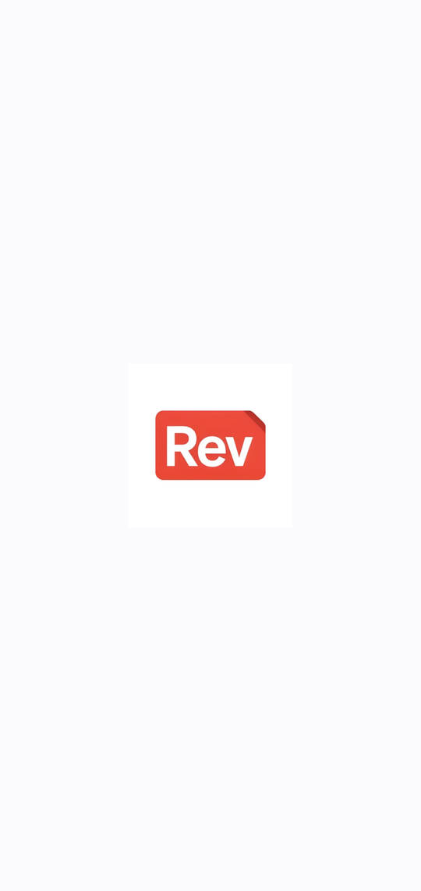
  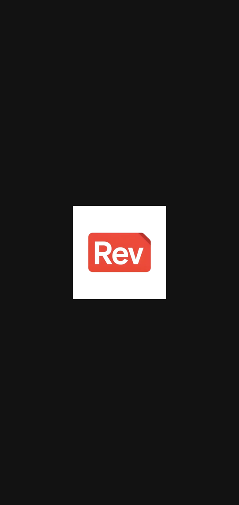
  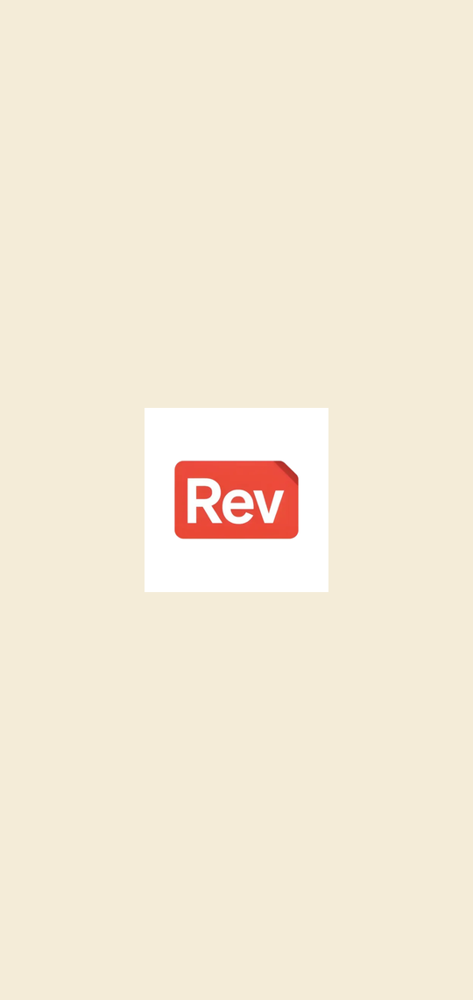
  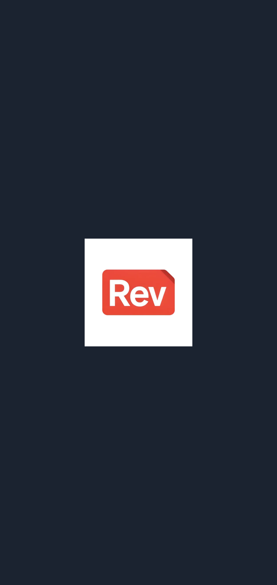
</p>

## Features

**Reading**
- PDF, EPUB, DOC, DOCX (PDF fixed-layout; EPUB/DOCX reflowable).
- Three reading themes: **Light / Dark / Sepia**. Dark text is a soft gray, never harsh white.
- Typography (reflowable): font family (Alice, Comfortaa, Merriweather, Roboto, Noto Serif),
  font size, font thickness, alignment (justify/left/center/right), hyphenation, page margins,
  line spacing.
- Per-document brightness, table of contents, in-document search, page thumbnails.
- A chrome-free reading surface — controls stay out of the way and live in **Reader settings**.

**Signature interactions**
- **Hold-to-highlight** — long-press text to highlight and pick a marker color. Toggleable.
- **Selection → search** — selecting text raises a draggable bottom sheet (preview → drag up for
  full in-app results), powered by your chosen engine.

**Library**
- "Reading Now" shelf with covers, format/size, progress and quick actions.
- "About Document" detail screen; import via the system file picker.

**Settings**
- Theme, highlighting on/off, selection bottom sheet on/off with trigger
  (**on selection** by default, or **tap a word**; scrolling never triggers it).
- Search engine: Google / DuckDuckGo / Yandex / Yahoo / Disabled.
- Reading mode (paginated / scroll) and the full reader display panel.

## Tech stack

Expo SDK 54 · React Native 0.81 · expo-router 6 · react-native-paper (MD3) · Zustand ·
expo-sqlite · react-native-webview · @gorhom/bottom-sheet · expo-brightness.

Document rendering is WebView-based (PDF.js for PDF, epub.js for EPUB/DOCX) so text selection,
highlighting and theming behave identically across formats.

## Getting started

```bash
npm install
npx expo start          # then press a for Android, or scan the QR with a dev build
```

> Some native modules (WebView, SQLite, brightness) require a **custom dev client** — Expo Go is
> not sufficient. Build one with `npx expo run:android` (or EAS) when wiring up the reader engine.

## Project structure

```
src/
  app/                 expo-router routes (library, document, reader, settings)
  components/          shared UI (DocumentCover, DocumentListItem, …)
  db/                  expo-sqlite schema + queries
  store/               Zustand stores (settings, library)
  theme/               design tokens + MD3 themes
  lib/                 small helpers
ref/                   reference screenshots
```
